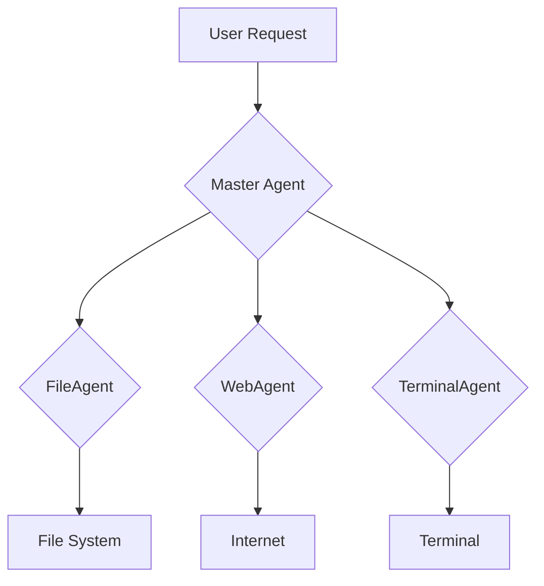

# marla :Agentic Pipeline Project

This project implements an agentic pipeline using the Google Agent Development Kit (ADK) framework. It features a master agent that supervises and delegates tasks to a team of specialized agents, each equipped with a set of tools to accomplish specific tasks.

## Table of Contents

- [Project Overview](#project-overview)
- [Architecture](#architecture)
  - [Master Agent](#master-agent)
  - [Specialized Agents](#specialized-agents)
  - [Tools](#tools)
- [Getting Started](#getting-started)
  - [Prerequisites](#prerequisites)
  - [Installation](#installation)
  - [Running the Agentic Pipeline](#running-the-agentic-pipeline)
- [Project Structure](#project-structure)
- [Future Enhancements](#future-enhancements)
- [License](#license)

## Project Overview

The goal of this project is to demonstrate a robust and extensible agentic system capable of handling diverse user requests by leveraging the power of multi-agent collaboration. The system is designed to be modular, allowing for easy addition of new agents and tools.

## Architecture

The agentic pipeline is built around a hierarchical structure:

### Master Agent

The `MasterAgent` acts as the central coordinator. Its primary responsibilities include:

- Receiving user requests.
- Analyzing the request to determine the most suitable specialized agent(s) to handle the task.
- Delegating the task to the selected specialized agent(s).
- (Future) Orchestrating complex workflows involving multiple specialized agents.

### Specialized Agents

Currently, the project includes the following specialized agents:

- **FileAgent**: Handles operations related to local files, such as searching and editing.
- **WebAgent**: Specializes in web-related tasks, including web search and information retrieval.
- **TerminalAgent**: Executes terminal commands and captures their output.

Each specialized agent is equipped with a specific set of tools relevant to its domain.

### Tools

Tools are functions that agents can call to interact with the external environment or perform specific actions. The following tools are implemented:

- `local_file_search(directory: str, pattern: str) -> List[str]`: Searches for files matching a pattern within a specified directory.
- `local_file_edit(file_path: str, content: str)`: Edits the content of a local file, overwriting its existing content.
- `web_search(query: str) -> str`: Performs a web search and returns simulated top results.
- `terminal_use(command: str) -> str`: Executes a terminal command and returns its output.

## Getting Started

### Prerequisites

- Python 3.9+
- pip
- Google Agent Development Kit (ADK)

### Installation

1. Clone the repository:

   ```bash
   git clone <repository_url>
   cd agentic_pipeline
   ```

2. Install the required packages:

   ```bash
   pip install google-adk
   ```

3. Set up your Google API Key:

   Create a `.env` file in the `multi_tool_agent/` directory with your Google API Key:

   ```
   GOOGLE_GENAI_USE_VERTEXAI=FALSE
   GOOGLE_API_KEY=YOUR_ACTUAL_GOOGLE_API_KEY
   ```
   Replace `YOUR_ACTUAL_GOOGLE_API_KEY` with your actual API key obtained from [Google AI Studio](https://aistudio.google.com/).

### Running the Agentic Pipeline

To run the agentic pipeline and interact with the agents via the ADK web UI, execute the following command from the `agentic_pipeline` directory:

```bash
python main.py
```

This will launch the ADK web UI, typically accessible at `http://localhost:8000`. You can then select the `MasterAgent` from the dropdown and provide your requests.

Alternatively, you can use the `adk run` command for direct CLI interaction (replace `"What is the weather in New York?"` with your desired query):

```bash
cd agentic_pipeline && adk run --agent multi_tool_agent --query "What is the weather in New York?"
```

## Project Structure

```
agentic_pipeline/
├── main.py
├── README.md
├── tools.py
└── multi_tool_agent/
    ├── __init__.py
    ├── agent.py
    ├── .env
    └── specialized_agents.py
```

- `main.py`: The entry point for the application, handling CLI arguments and launching the ADK web UI or facilitating direct agent interaction.
- `README.md`: This documentation file.
- `tools.py`: Contains the definitions of all custom tools that agents can utilize.
- `multi_tool_agent/`:
  - `__init__.py`: Initializes the Python package.
  - `agent.py`: Defines the `MasterAgent` and integrates the specialized agents as its sub-agents.
  - `.env`: Stores environment variables, including the Google API Key.
  - `specialized_agents.py`: Defines the `FileAgent`, `WebAgent`, and `TerminalAgent`, along with their respective tool assignments.

## Future Enhancements

- Implement more sophisticated master agent logic for complex task orchestration and dynamic agent selection.
- Add more specialized agents for diverse domains (e.g., data analysis, image generation).
- Integrate with external APIs for real-world data access (e.g., actual weather APIs, advanced search engines).
- Develop a more interactive CLI for direct agent interaction without relying on the `adk run` command.
- Implement persistent memory for agents to retain context across interactions.

## License

This project is licensed under the MIT License - see the LICENSE file for details.


## Flowchart




```mermaid
sequenceDiagram
    participant User
    participant CLI
    participant MainPy as main.py
    participant MasterAgent as Master Agent
    participant FileAgent as FileAgent
    participant WebAgent as WebAgent
    participant TerminalAgent as TerminalAgent
    participant Tools

    User->>CLI: Enters request
    CLI->>MainPy: Passes request
    alt If request is provided
        MainPy->>MainPy: Instructs user to use `adk run`
    else If no request (launch UI)
        MainPy->>MainPy: Launches ADK Web UI (`adk web`)
        User->>MasterAgent: Interacts via Web UI
    end

    MasterAgent->>MasterAgent: Analyzes request
    MasterAgent->>MasterAgent: Delegates to appropriate agent

    alt File-related request
        MasterAgent->>FileAgent: Delegates task
        FileAgent->>Tools: Calls file tools (search, edit)
        Tools-->>FileAgent: Returns tool results
        FileAgent-->>MasterAgent: Returns task result
    alt Web-related request
        MasterAgent->>WebAgent: Delegates task
        WebAgent->>Tools: Calls web search tool
        Tools-->>WebAgent: Returns tool results
        WebAgent-->>MasterAgent: Returns task result
    alt Terminal-related request
        MasterAgent->>TerminalAgent: Delegates task
        TerminalAgent->>Tools: Calls terminal tool
        Tools-->>TerminalAgent: Returns tool results
        TerminalAgent-->>MasterAgent: Returns task result
    end

    MasterAgent-->>User: Provides final response
```
